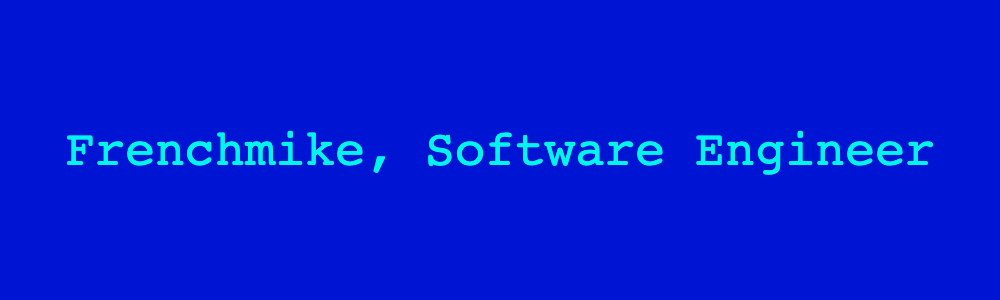

<h3> 🛠 &nbsp;Tech Stack</h3>

- 💻 &nbsp;
  
  
  
  
- 🌐 &nbsp;
  
  
  
  
  
  
- 🛢 &nbsp;
  
  
- ⚙️ &nbsp;
  
  
  
- 🔧 &nbsp;
  
  
  
- 🖥 &nbsp;
  
  
  

 

### Hi there 👋

- 🔭 I’m currently working on a Bachelor Degree in CS
- 🔭 I plan on studying more Math and CS 
- 🌱 I’m currently learning Python, C++, Web Development
- 👯 I’m looking to collaborate on open source Github projects (not yet)
- 🤔 I’m looking for help with anyone who is interested in what I am learning.  Contact me.
- 💬 Ask me about anything CS related, school, business ventures..
- 📫 How to reach me via email: frenchmike@gmail.com
- 😄 Some things I like: Brazilian Jiu-Jitsu, Chess, Tropical Sunsets.
- ⚡ Fun fact: I started my CS degree at 48 years old.

